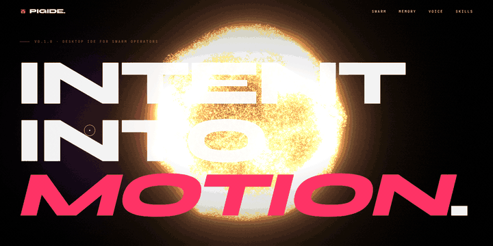
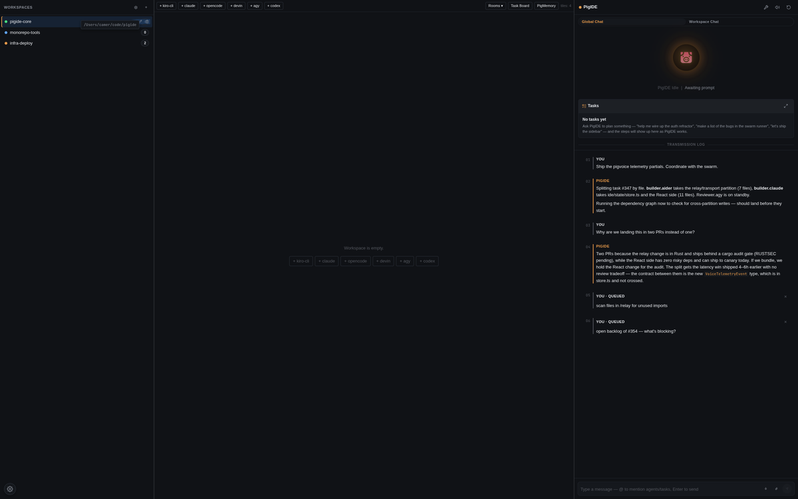
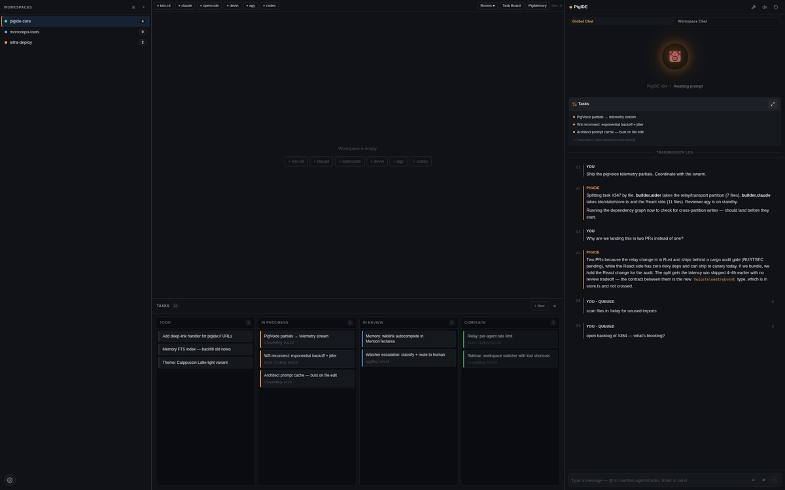
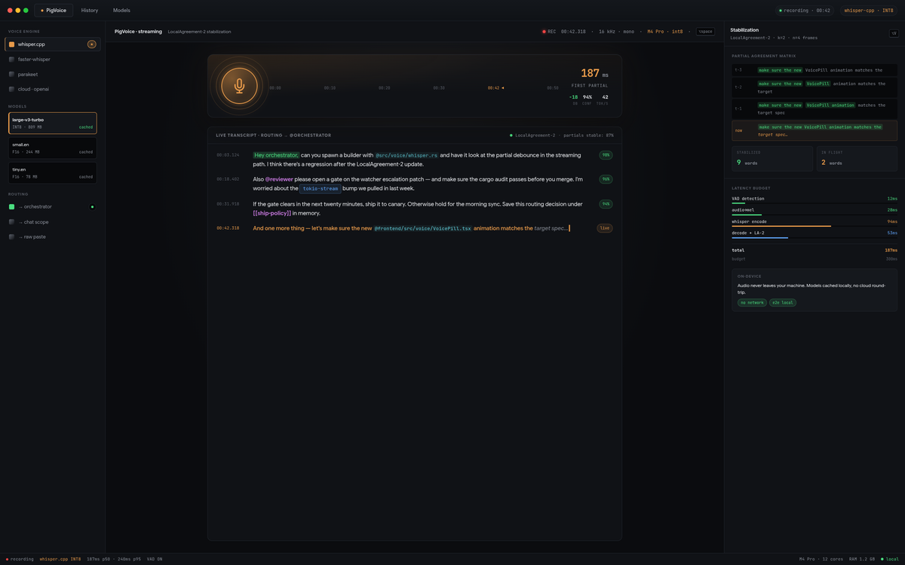
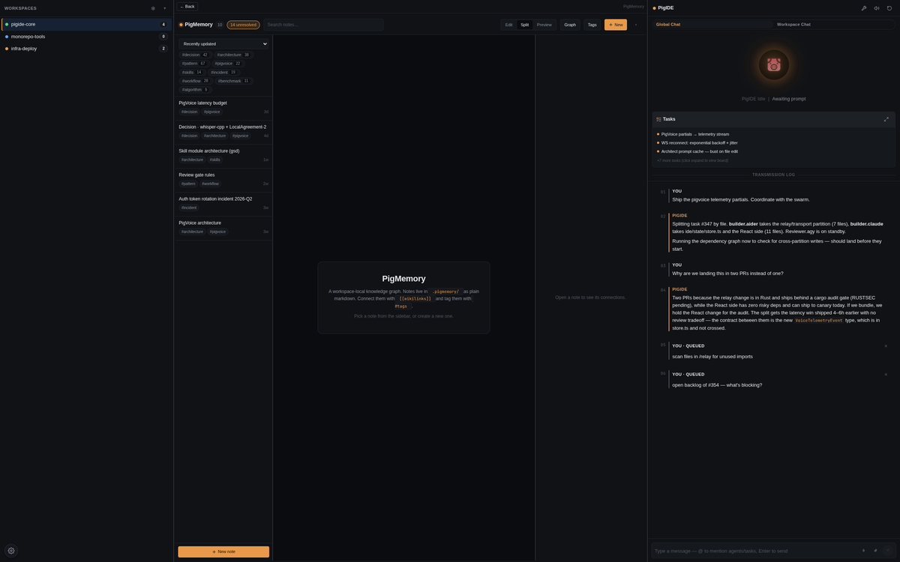
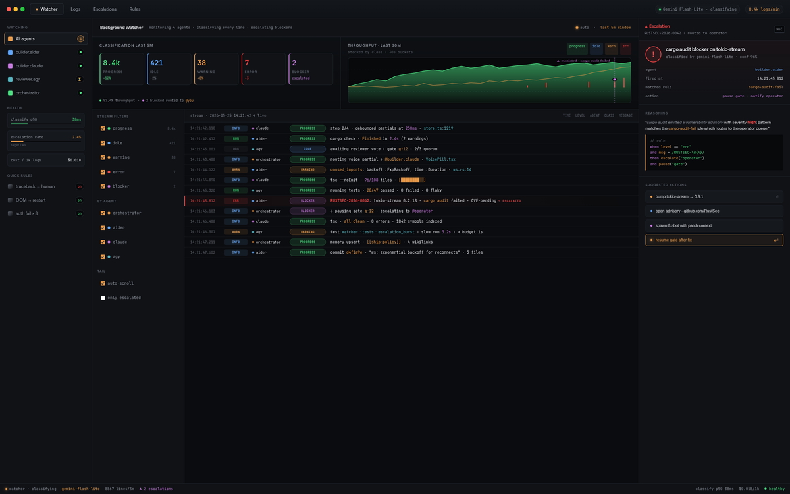
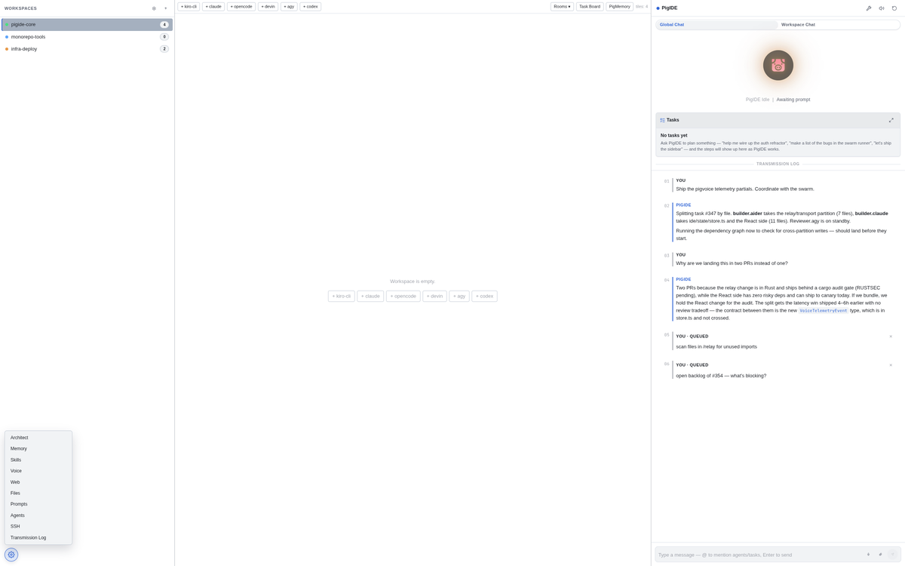

<div align="center">

  <a href="https://kroch228.github.io/pigide-landing/">
    <picture>
      <source srcset=".github/readme/hero.webp" type="image/webp"/>
      
    </picture>
  </a>

  <br/>

  [](https://kroch228.github.io/pigide-landing/)
  [](LICENSE)
  [](#stack)
  [](#prerequisites)
  [](CODE_OF_CONDUCT.md)

  <br/>

  **A desktop IDE that hosts a pool of CLI coding agents as tiled terminal panes.**
  <br/>You direct. The swarm builds. Voice in. Code out.

  <br/>

  **→ <a href="https://kroch228.github.io/pigide-landing/">View the live landing page</a>**

  <sub>See <a href="docs/superpowers/specs/2026-05-14-pigide-design.md"><code>docs/superpowers/specs/2026-05-14-pigide-design.md</code></a> for the full design.</sub>

</div>

---

## Quickstart

```bash
git clone https://github.com/<your-fork>/pigide
cd pigide/frontend && pnpm install && cd ../src-tauri
cargo tauri dev
```

Once the window is open:

1. **+** in the Workspaces sidebar — your first workspace.
2. **+ kiro-cli** (or any agent type) inside an empty TilingArea — terminal tile spawns with the agent already running.
3. Talk to the orchestrator on the right pane to dispatch tasks across tiles.
4. `Ctrl+,` opens Settings · `Ctrl+1..9` jumps between workspaces.

For voice: hold the configured PTT hotkey (off by default — bind in `Settings → Voice`) and speak. Partials stream into the focused input within 300 ms.

<br/>

## What's inside

<table>
<tr>
<td width="50%" valign="top">

<br/><br/>

### `01 / Swarm` &nbsp;Orchestration

Coordinate a roster of specialised agents — `aider`, `claude`, `opencode`, `devin`, `agy`, `codex` — each in a tiled terminal pane. Roles: orchestrator, builder, reviewer, scout. You speak, the layout reacts.

`tiled panes` · `role routing` · `live layout`

</td>
<td width="50%" valign="top">

<br/><br/>

### `02 / Workflow` &nbsp;Autonomous

Built-in task state machine, file locks, and review gates with quorum voting keep the swarm aligned and code pristine across multiple agents working the same repo.

`state machine` · `file locks` · `quorum gates`

</td>
</tr>
<tr>
<td width="50%" valign="top">

<br/><br/>

### `03 / Voice` &nbsp;Sub-300 ms

Speak in plain language. Local STT streams partials to the orchestrator while you're still talking. No round-trip to the cloud.

`local STT` · `streaming` · `VAD`

</td>
<td width="50%" valign="top">

<br/><br/>

### `04 / Memory` &nbsp;Workspace

Conversations, decisions, and artifacts persist per workspace. Agents recall context across restarts; you keep the receipts.

`SQLite` · `per-workspace` · `structured`

</td>
</tr>
<tr>
<td width="50%" valign="top">

<br/><br/>

### `05 / Watcher` &nbsp;Background

A seamless supervisor on Gemini Flash-Lite that monitors agent stdout, classifies events, and intelligently escalates blockers to human review without hanging the swarm.

`Gemini` · `stdout classify` · `human escalate`

</td>
<td width="50%" valign="top">

<br/><br/>

### `06 / Skills` &nbsp;Extensible

Dynamic Architect prompt-modules. Auto-discovered YAML definitions, hot-reloading context injections, tailored per turn. Your prompts become a system.

`YAML` · `hot-reload` · `per-turn inject`

</td>
</tr>
</table>

<br/>

<div align="center">
  
</div>

<br/>

<div align="center">
  
</div>

<br/>

## Stack

- **Rust core (Tauri 2):** `portable-pty`, `rusqlite`, `reqwest`, `tokio`, `cpal`, `whisper-rs`
- **Frontend (React + TypeScript + Vite):** `allotment`, `@xterm/xterm`, `zustand`

## Prerequisites

- Rust 1.80+ (`rustc 1.95` tested)
- Node 20+ + pnpm 9+ (`node 25`, `pnpm 10` tested)
- Linux: `webkit2gtk-4.1` and PulseAudio/ALSA dev libs
- An OmniRouter instance running locally (defaults to `http://localhost:20128`)
- `~/.local/bin/kiro-cli` and `/usr/bin/claude` for the agent tiles

<br/>

## Build

<details>
<summary><b>Development run</b> — <code>cargo tauri dev</code></summary>

```bash
# Install frontend deps
cd frontend
pnpm install
cd ..

# Run the dev server (Vite) + Tauri window
cd src-tauri
cargo tauri dev
# (or, if @tauri-apps/cli is installed in frontend/, `pnpm tauri dev` from frontend/)
```

</details>

<details>
<summary><b>Release build</b> — <code>./scripts/build.sh</code></summary>

Один скрипт собирает фронтенд и Tauri-приложение, автоматически выбирает Whisper-бэкенд (GPU/CPU) и складывает всё в `./dist/` в корне репозитория.

```bash
./scripts/build.sh
```

Что попадает в `dist/`:

```
dist/
├── bin/            # raw executables (pigide, pigide-cli)
├── bundle/         # установщики (.deb / .rpm / .AppImage / .dmg / .msi)
└── BUILD_INFO.txt  # дата, коммит, какой GPU-бэкенд использован
```

GPU-бэкенд определяется автоматически (CUDA → ROCm → Vulkan → CPU; на macOS — Metal). Принудительно выбрать можно через `PIGIDE_GPU`:

```bash
PIGIDE_GPU=cuda    ./scripts/build.sh   # NVIDIA, нужен CUDA toolkit
PIGIDE_GPU=hipblas ./scripts/build.sh   # AMD ROCm
PIGIDE_GPU=vulkan  ./scripts/build.sh   # cross-vendor Vulkan
PIGIDE_GPU=metal   ./scripts/build.sh   # Apple Silicon
PIGIDE_GPU=cpu     ./scripts/build.sh   # CPU-only
```

В рантайме можно форсить CPU без пересборки: `PIGIDE_WHISPER_CPU=1`.

Перед сборкой скрипт показывает **preflight**: текущая ветка, коммит, ahead/behind относительно `origin/main` и список незакоммиченных изменений. Если working tree грязный — спросит подтверждение (это страховка от ситуации, когда забыл закоммитить и потом потерял правки при checkout). Чтобы пропускать вопрос в CI: `PIGIDE_BUILD_DIRTY=1 ./scripts/build.sh`.

</details>

<details>
<summary><b>First-run notes</b> — где живут данные, логи, модели</summary>

- Database: `~/.config/pigide/db.sqlite`
- Whisper model: downloaded on first PTT use to `~/.cache/pigide/ggml-small.bin`
- Logs: stderr, set `RUST_LOG=pigide=debug,info`

</details>

<br/>

## Architect model

The Kiro orchestrator runs against a swappable LLM backend. Default is the **Anthropic Messages API** with **Claude Opus 4.5** as primary and **Claude Opus 4** as automatic fallback on `5xx` / `529` / timeout. Set `ANTHROPIC_API_KEY` in the environment, or paste a key into `Right pane → Settings → API key`.

OmniRouter (OpenAI-compatible) remains available — switch via `Right pane → Settings → Provider`. See [`docs/architect-model.md`](docs/architect-model.md) for the full feature list (streaming, tool calls, prompt caching, fallback policy).

<br/>

## Watcher (опционально)

<details>
<summary>Фоновый супервизор stdout агентов на Gemini Flash-Lite</summary>

Watcher слушает stdout каждого спавненного агента, классифицирует чанки через Google AI Studio Generative Language API (по умолчанию `gemini-2.5-flash-lite` — Gemma 3 4B IT из изначального брифа AI Studio v1beta больше не отдаёт; live-проверка показала, что Gemma 4 31B уходит в reasoning-prose вместо строгого JSON, а Flash-Lite обеспечивает strict-JSON и стоит в ~10× меньше) и эскалирует «вопросы к человеку» Architect'у в почтовый ящик `role:coordinator`, на тред `watcher:<agent_id>`. Ответ Architect'а автоматически инжектится обратно в stdin исходного агента — агент не зависает на интерактивном prompt'е, пока вы не подойдёте.

### Включить

Опт-ин на этапе сборки:

```bash
cd src-tauri
cargo build --features watcher
# или для дебаг-запуска
GEMINI_API_KEY=AIzaSy... cargo tauri dev --features watcher
```

Без `GEMINI_API_KEY` Watcher тихо отключится при старте (одна warning-строка в логах) — остальное приложение работает как обычно.

### Переменные окружения

| Переменная | По умолчанию | Назначение |
|-|-|-|
| `GEMINI_API_KEY` | — (обязательна) | Ключ Google AI Studio. Уходит только в заголовке `x-goog-api-key`, не в URL и не в логи. |
| `PIGIDE_WATCHER_RPM` | `10` | Per-agent rate-limit (запросов в минуту). Token-bucket: при переполнении чанк дропается, не ставится в очередь. |
| `PIGIDE_WATCHER_MODEL` | `gemini-2.5-flash-lite` | Имя модели Generative Language API. Меняй, если у твоего ключа доступна другая Gemma/Gemini-Flash-Lite. |

### MCP-инструмент

Когда Watcher активен, MCP-сервер регистрирует один новый инструмент:

```json
{ "method": "tools/call", "params": { "name": "watcher_status", "arguments": {} } }
```

Возвращает `{enabled, rpm, agents: { <agent_id>: {last_classification, calls_this_minute, blocked_until, dropped} }}` — удобно для дашбордов и для проверки, что бакет не залип.

### Стоимость

`gemini-2.5-flash-lite` доступен в free-tier AI Studio с per-project лимитом порядка 30 RPM на ключ (на момент написания). Дефолт `PIGIDE_WATCHER_RPM=10` подобран так, чтобы один агент не выедал лимит ключа в одиночку. На paid-тарифах Flash-Lite — самая дешёвая модель Gemini API, ~$0.075 за 1M входных токенов и $0.30 за 1M выходных (текст).

</details>

<br/>

## PigVoice — instant voice-to-text

<details>
<summary>Streaming voice layer · sub-300 ms perceived latency · LocalAgreement-2 merger</summary>

PigVoice is the streaming voice layer baked into PigIDE. Goal: **sub-300 ms perceived latency** from speech to first visible token, with partial hypotheses dropped straight into the focused input.

### How it works

```
mic (cpal) → resample 16k → Silero-style VAD → rolling-window Whisper
            → LocalAgreement-2 merger → voice://partial events
            → on VAD endpoint: clean final → voice://final
```

The on-device engine is `whisper.cpp` (via `whisper-rs`, no new native deps). Partials are stabilised with **LocalAgreement-2**: a token only commits to the visible UI once two successive decoding passes agree on it, so the text never wobbles backwards. See [`PIGVOICE_RESEARCH.md`](./PIGVOICE_RESEARCH.md) and [`PIGVOICE_PLAN.md`](./PIGVOICE_PLAN.md) for the full design.

### Settings (in `~/.config/pigide/db.sqlite`, table `settings`)

| key | default | meaning |
|-|-|-|
| `voice.partial_enabled` | `true` | turn streaming partials on/off (falls back to batch) |
| `voice.partial_hop_ms` | `250` | re-decode cadence while in a speech segment |
| `voice.endpoint_silence_ms` | `400` | silence required to commit a final segment |
| `voice.engine` | `whisper-streaming` | `whisper-streaming` / `whisper-batch` / `deepgram` (cloud, opt-in) |
| `voice.cloud_api_key` | unset | Deepgram Nova-3 key (kept in user settings, never written to git) |
| `voice.cloud_endpoint` | Deepgram default | overrideable WS endpoint |
| `voice.hotkey_enabled` | `false` | global PTT hotkey (off by default; conflicts with WMs) |
| `voice.record_mode` | `push-to-talk` | or `toggle` |
| `voice.inject_enabled` | `false` | type final transcript into the focused window |
| `whisper.model_id` | `small` | one of `tiny` / `base` / `small` / `medium` / `large` / `distil-large` |
| `whisper.language` | `auto` | Whisper language hint |

The streaming path defaults to `tiny` for first-token speed; pick a larger model from the in-app voice settings panel for better accuracy. If the model isn't downloaded yet, the streaming loop quietly no-ops and the existing batch path triggers a download on `stop`.

### GPU acceleration (optional)

By default PigIDE builds Whisper CPU-only. The release build script (`./scripts/build.sh`) автоматически определяет GPU; чтобы выбрать вручную, экспортни `PIGIDE_GPU=cuda|hipblas|vulkan|metal|cpu` — см. секцию [Build](#build). Whisper-контекст пробует GPU и откатывается на CPU с `warn!`-логом, если инициализация не удалась (нет toolkit'а, нет устройства, OOM и т.д.). В рантайме форсить CPU — `PIGIDE_WHISPER_CPU=1`.

Системные зависимости по бэкендам:

- `gpu-cuda` — CUDA toolkit (cublas, cudart, nvcc). Arch: `sudo pacman -S cuda`. Ubuntu: `sudo apt install nvidia-cuda-toolkit`.
- `gpu-hipblas` — AMD ROCm.
- `gpu-vulkan` — Vulkan SDK.
- `gpu-metal` — Apple Silicon, ничего ставить не нужно.

Verify the live backend in logs (`RUST_LOG=pigide=info`):

```
whisper: GPU backend initialized (model=small)
```

### Events (Tauri)

| event | payload | when |
|-|-|-|
| `voice://state` | `{ state: "idle" \| "recording" \| "transcribing" }` | start/stop |
| `voice://partial` | `{ stable, unstable, segment_id }` | every `partial_hop_ms` mid-segment |
| `voice://final` | `{ text, segment_id }` | VAD endpoint or user stop |
| `voice://transcript` | `{ text }` | back-compat alias of `final` |
| `voice://engine-error` | `{ engine, error }` | non-fatal engine failure |
| `voice://download` | `{ bytes, total }` | model download progress |

### Tests

```bash
cd src-tauri
# unit tests for the merger, VAD, mode controller, cloud config, etc.
cargo test --lib voice::

# end-to-end streaming integration test (no mic / no model needed):
cargo test --test integration_streaming

# latency benchmark — fails if median first-partial > 600 ms:
cargo test --test bench_latency --release
```

</details>

<br/>

## Skills — extensible Architect prompt-modules

<details>
<summary>Auto-discovered YAML modules · hot-reload · per-turn injection</summary>

The Architect's prompt is no longer fixed. **Skills** are small named `.md` modules with a YAML frontmatter that the Architect auto-discovers from `~/.pigide/skills/` and `<workspace>/.pigide/skills/` and selects per turn (by tags / triggers / explicit `@skill:<id>` mention).

```markdown
---
id: builder-brief-writer
name: Builder Brief Writer
description: Writes a self-contained brief for a Builder agent
priority: 60
tags: [dispatch, builder]
triggers: [builder, "сборщик"]
---
You are composing a Builder brief.
GOAL: {{goal}}
{{#if files_in_scope}}FILES: {{files_in_scope}}{{/if}}
```

Five built-ins ship by default — including `user-skill-prompt-engineer`, the meta-skill the Architect invokes whenever it's about to dispatch to a sub-agent. The Skills panel (right pane → Skills) lists everything, toggles enable/disable, shows the last turn's selection trace, and lets you stub a new user skill from the UI.

The Architect prompt itself (`src-tauri/src/orchestrator/prompt.rs`, v2 — gold-standard meta-prompting; v1 archived alongside as `prompt.v1.rs`) drives every turn through a deterministic 8-step pipeline: **intent → contract** (role / goal / exit_criteria) → **skill selection** → **memory grounding** → **decomposition** (Plan-and-Solve / Least-to-Most) → **draft** (via `[[user-skill-prompt-engineer]]`) → **self-critique** (Self-Refine + Chain-of-Verification) → **dispatch** (parallel where independent) → **observe + self-improve** (`create_memory` for new patterns). Research citations are at the top of `prompt.rs`.

See [`docs/skills.md`](docs/skills.md) for the author guide and [`SKILLS_DESIGN.md`](SKILLS_DESIGN.md) for the design.

```bash
# unit tests (parser, router, composer, registry)
cargo test --lib skills::

# integration test (end-to-end compose + hot-reload)
cargo test --test skills_integration
```

</details>

<br/>

## Acknowledgements

PigIDE integrates third-party software whose licenses are reproduced in `LICENSES/` and summarised in [`NOTICE`](./NOTICE):

- **[Ruflo](https://github.com/ruvnet/ruflo)** (MIT, © 2024-2026 ruvnet) — used as a supervised Node.js sidecar (`pigide-ruflod`) that powers the orchestrator-ledger layer. PigIDE talks to it over its MCP server (transport=stdio); see `src-tauri/src/ruflo/` for the bridge.

<br/>

<div align="center">
  <sub>© 2026 PigIDE · Tauri · React · Rust · Three.js · <b>local · forever</b></sub>
  <br/>
  <sub><a href="https://kroch228.github.io/pigide-landing/">kroch228.github.io/pigide-landing</a></sub>
</div>
